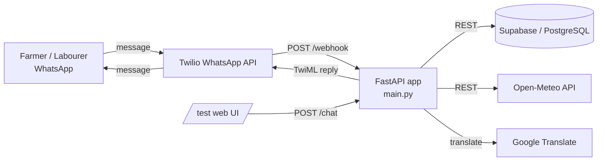

# 🌾 Farm Connect

AI-powered WhatsApp platform connecting **farmers**, **agricultural labourers**, and **equipment owners** — built for the Unbound Hackathon.

## Problem

Farmers in rural India lose crops every season due to labour shortages at critical times (harvest, planting) and limited access to machinery like tractors or tillers. Labourers, meanwhile, have no easy way to discover nearby work. Coordination today happens informally, by word of mouth, and breaks down at scale.

## Solution

Farm Connect runs entirely over **WhatsApp** — no app to install. Farmers post jobs, labourers confirm them, both sides rate each other after the work is done, and a no-show/cancellation penalty system builds mutual accountability over time. A separate equipment-rental flow lets farmers list and book tools like tractors directly with each other. Tamil, Hindi, and English are all supported, and a 3-day rain forecast is pulled in automatically when a job is posted or requested on demand.

## Features

| Category | Commands |
|---|---|
| Onboarding | `FARMER` / `LABOURER`, `LANGUAGE`, `HELP`, `UPDATE SKILL` |
| Jobs (farmer) | `POST JOB`, `MY JOBS`, `CANCEL <id>`, `REHIRE <labourer>` |
| Jobs (labourer) | `VIEW JOBS`, `CONFIRM <id>`, `NO SHOW <farmer> <id>`, `JOB DONE <id>` |
| Accountability | `RATE <id> <1-5>`, `MY PROFILE`, `MY LABOURERS`, `MY FARMERS`, `JOB HISTORY` |
| Equipment | `RENT EQUIPMENT`, `VIEW EQUIPMENT`, `MY EQUIPMENT`, `BOOK EQUIPMENT <id>`, `CANCEL EQUIPMENT <id>` |
| Planning | `WEATHER` (3-day forecast), `SUBSIDIES`, `SUBSIDY <id>`, `TODAY`, `MY DAYS` |

Send `HELP` at any time for a role-specific menu.

## Tech Stack

- **FastAPI** — webhook + REST API
- **Twilio WhatsApp API** — messaging transport
- **Supabase (PostgreSQL via PostgREST)** — data store, accessed over the REST API (no ORM)
- **Open-Meteo** — free, no-key weather forecasts
- **deep-translator (Google Translate)** — Tamil / Hindi message translation, cached in memory
- Built-in `/test` page — a WhatsApp-style chat UI for testing the bot in a browser without Twilio

## Architecture



All conversation state (current step in a flow, e.g. "awaiting job wage") lives in an **in-memory dict** (`sessions`), keyed by phone number, for the lifetime of the process. This is intentional for a hackathon build — see *Known limitations* below.

### Request flow for a WhatsApp message

1. Twilio receives the user's WhatsApp message and POSTs it to `/webhook` as form data (`From`, `Body`).
2. `handle_message(phone, text)` looks up the user's current session step and role (farmer/labourer, looked up from Supabase by phone number), and either advances a multi-step flow (registration, posting a job, listing equipment) or handles a one-shot command (`WEATHER`, `VIEW JOBS`, `CONFIRM <id>`, etc.).
3. Database reads/writes go straight to Supabase's auto-generated REST API (PostgREST) with the service key in the headers — no separate ORM layer.
4. The reply is wrapped in TwiML and returned to Twilio, which delivers it back over WhatsApp.

The `/chat` and `/reset` endpoints mirror this without Twilio, for the `/test` browser UI.

## Setup

### 1. Prerequisites
- Python 3.10+
- A [Supabase](https://supabase.com) project (free tier is fine)
- A [Twilio](https://www.twilio.com) account with the WhatsApp Sandbox enabled

### 2. Clone and install
```bash
git clone <your-repo-url>
cd farm-connect
pip install -r requirements.txt
```

### 3. Create the Supabase tables
Run the SQL in [Supabase schema](#supabase-schema) below in the Supabase SQL editor.

### 4. Environment variables
Create a `.env` file in the project root:

```env
SUPABASE_URL=https://your-project.supabase.co
SUPABASE_KEY=your-supabase-service-role-key
TWILIO_ACCOUNT_SID=your-twilio-account-sid
TWILIO_AUTH_TOKEN=your-twilio-auth-token
```

| Variable | Where to find it | Notes |
|---|---|---|
| `SUPABASE_URL` | Supabase → Project Settings → API | e.g. `https://xxxx.supabase.co` |
| `SUPABASE_KEY` | Supabase → Project Settings → API | Use the **service_role** key — the app talks to PostgREST directly with no row-level auth |
| `TWILIO_ACCOUNT_SID` | Twilio Console dashboard | |
| `TWILIO_AUTH_TOKEN` | Twilio Console dashboard | |

The Twilio WhatsApp Sandbox sender number is currently hardcoded in `main.py` as `TWILIO_FROM = "whatsapp:+14155238886"`. If you use a different sender (e.g. a production WhatsApp number), update that constant.

### 5. Run locally
```bash
uvicorn main:app --reload --port 8000
```
- Browser test UI: `http://localhost:8000/test`
- Health check: `http://localhost:8000/ping`

### 6. Point Twilio at your server
In the Twilio Console → WhatsApp Sandbox settings, set "When a message comes in" to:
```
https://<your-deployed-url>/webhook
```
(Use [ngrok](https://ngrok.com) for local testing, or your Render/Railway/Fly URL once deployed.)

### 7. Deploying
The app includes a `keep_alive()` background thread that pings its own `/ping` endpoint every 14 minutes — this is specifically to stop Render's free tier from spinning the instance down. If you deploy elsewhere, you can leave it as-is (it's harmless) or remove it.

## Supabase Schema

```sql
create table farmers (
  id              serial primary key,
  phone           text unique not null,
  name            text,
  location        text,
  rating          numeric default 0,
  total_ratings   integer default 0,
  penalty_balance integer not null default 0,
  created_at      timestamp default now()
);

create table labourers (
  id              serial primary key,
  phone           text unique not null,
  name            text,
  location        text,
  skill           text,
  rating          numeric(2,1) default 0,
  total_ratings   integer default 0,
  no_show_count   integer default 0,
  penalty_balance integer not null default 0,
  created_at      timestamp default now()
);

create table jobs (
  id              serial primary key,
  farmer_phone    text not null,
  labourer_phone  text,
  work_type       text,
  location        text,
  wage            text,     -- stored as entered (e.g. "450"), not numeric
  num_labourers   integer,
  start_date      text,     -- stored as displayed (e.g. "01 July 2026")
  status          text default 'open',  -- open | confirmed | completed | cancelled
  rated           boolean default false,         -- farmer has rated the labourer
  labourer_rated  boolean default false,         -- labourer has rated the farmer
  created_at      timestamp default now()
);

create table equipment (
  id              bigint generated always as identity primary key,
  owner_phone     text not null,
  name            text not null,
  rent_per_day    text not null,  -- stored as entered, not numeric
  location        text,
  available_until text,           -- null = "ongoing"
  available       boolean default true,
  booked_by       text default null,
  created_at      timestamptz default now()
);
```

> No foreign key constraints are defined on `farmer_phone`, `labourer_phone`, `owner_phone`, or `booked_by` — referential integrity between tables is enforced only in application code, not by the database. Worth adding (`references farmers(phone)`, etc.) if you continue this past the hackathon.

> The app uses the Supabase **REST API (PostgREST)** directly via `requests`, not the Supabase Python client or an ORM, so no row-level security policies are enforced at the database layer — the service-role key bypasses RLS entirely. Don't expose `SUPABASE_KEY` client-side.

## Known limitations

- **In-memory state**: `sessions` (conversation step per phone) and `LANG_PREFS` (language choice) are plain Python dicts. They reset on every redeploy/restart and won't work correctly across multiple server instances. Fine for a hackathon demo; would need to move to Supabase or Redis for production.
- **No request authentication** on `/webhook`: Twilio's request signature isn't verified, so anyone who discovers the URL could POST fake webhook payloads. Twilio's `X-Twilio-Signature` validation would close this.
- The `/test` browser chat UI is unauthenticated and publicly reachable at `/test` if deployed — fine for a demo, but don't leave it exposed on a long-lived production URL without at least basic protection.

## License

MIT
